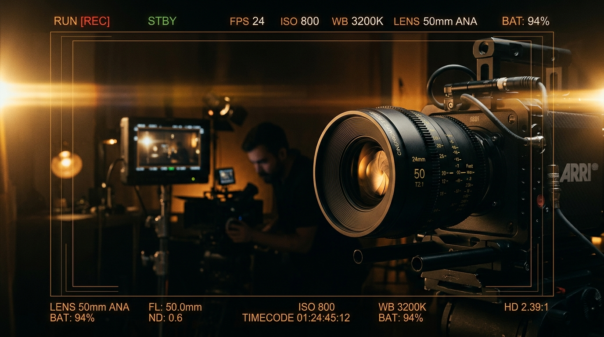

# 🎬 CinePrompt Studio — Premium Cinematography Prompt Desk

¡Tu estación de trabajo profesional para el diseño de prompts cinematográficos y dirección de fotografía virtual! 



**CinePrompt Studio** es una aplicación web interactiva diseñada para cineastas, directores de fotografía, artistas digitales de IA y creadores de contenido. Permite configurar planos con especificaciones técnicas reales de cámaras profesionales, ópticas, esquemas de iluminación y estéticas de color para compilar automáticamente prompts altamente optimizados (en **Inglés**, ideal para motores como **Midjourney, Flux, Stable Diffusion y DALL-E**, y su traducción al **Español** como guía de referencia).

---

## ✨ Características Principales

### 📹 1. CineMonitor Interactivo (Viewfinder en Tiempo Real)
El monitor de cámara integrado simula visualmente la configuración de tu toma en tiempo real:
* **Relación de Aspecto Variable:** Cambia dinámicamente el encuadre para visualizar composiciones en `2.39:1 Anamorphic Cinemascope`, `16:9 Widescreen`, `4:3 Academy`, `1:1 Square` o `9:16 Vertical`.
* **Simulador de LUTs y Colorimetría:** Visualiza el efecto de gradaciones icónicas como *Teal & Orange*, *Cyberpunk Neon*, *Kodak 2383*, *Chiaroscuro / Noir B&W*, *Technicolor de alta saturación* o *Pastel Dreams*.
* **Emulación de Grano de Película:** Modifica la textura del visor según el negativo elegido (`Kodak Vision3 500T`, `16mm Vintage Grain`, `Kodak Portra`, etc.) usando filtros vectoriales de ruido.
* **HUD Profesional Dinámico:** Incluye telemetría de cámara en pantalla: indicador de grabación (`REC` parpadeante), batería virtual, indicador de ISO/FPS, ángulo holandés (Dutch angle) reactivo y medidor dual de audio analógico (`CH1/CH2`) con simulación de modulación en vivo.

### 🎛️ 2. Orquestador de Parámetros de Cámara (PromptForm)
Toma el control absoluto de los aspectos fotográficos y técnicos de tu plano virtual:
* **Cámaras Legendarias:** Elige entre sensores como *ARRI Alexa LF*, *RED V-Raptor*, *Panavision Millennium DXL2*, *IMAX 70mm*, cámaras de película *35mm Vintage*, o equipos accesibles como *Sony FX3* y *iPhone Cinematic*.
* **Ópticas y Enfoque:** Configura distancias focales (de `18mm Ultra Wide` a `135mm Telephoto`), lentes anamórficos vs. esféricos, y aperturas extremas (de `f/1.2` para un Bokeh ultrasuave a `f/11` para nitidez profunda).
* **Movimiento y Dinamismo:** Integra técnicas físicas de movimiento en el prompt como *Dolly Shot*, *Camera Pan*, *Steadycam Tracking*, o planos espectaculares con *Drone Flyover*.
* **Luz y Dirección:** Modela el ambiente con luz de hora dorada, claroscuro, luces de neón, retroiluminación (`Backlight`), o luz de ventana difusa.

### ⚡ 3. Compilación de Prompts Bilingüe Simultánea
* Genera instantáneamente el código descriptivo optimizado en **Inglés**, estructurado con la sintaxis técnica ideal para motores de IA generativa de imágenes (ej. Midjourney v6, Flux.1, etc.).
* Proporciona la traducción equivalente en **Español** para que mantengas un control creativo exacto de la escena descrita.
* Botón de copiado rápido al portapapeles con confirmación visual interactiva.

### 🎲 4. Ruleta del Director (Director's Roulette)
¿Te falta inspiración? Usa la función aleatoria inteligente para mezclar automáticamente configuraciones de cámara, lentes, iluminación y estilos de color, junto con sujetos y ubicaciones temáticas (desde callejones lluviosos cyberpunk en Tokio hasta cocinas rústicas italianas en el atardecer).

### 🎨 5. Panel de Ajustes Preestablecidos (Presets)
Carga estéticas famosas instantáneamente con un solo clic:
* **Cyberpunk Noir (Blade Runner):** Iluminación de neón purpura/azul, lente anamórfico de 35mm, alto contraste.
* **Golden Hour Cinema:** Luz dorada difusa, ARRI Alexa, película Kodak Portra, Bokeh suave de f/1.8.
* **Vintage Monochrome (Film Noir):** Alto contraste blanco y negro, película granulada de 16mm, iluminación claroscuro dramática.
* **Hollywood Blockbuster:** Gradación Teal & Orange de alta fidelidad, Panavision anamórfico, planos de acción.
* **Snyder's Bleach Bypass:** Estética desaturada y sombría de alto contraste inspirada en el cine de acción de autor.

### 🗄️ 6. Historial de Tomas Guardadas
Conserva tu trabajo de producción directamente en el panel del historial. Se guarda localmente (`localStorage`), permitiendo:
* Volver a cargar cualquier configuración guardada previamente con un solo clic.
* Eliminar tomas individuales o limpiar el historial completo de producción.

---

## 🛠️ Tecnologías y Arquitectura

La aplicación está construida sobre un stack moderno, fluido e increíblemente optimizado:
* **React 18** con **TypeScript** para un flujo de tipado estricto y seguro.
* **Vite** como servidor de desarrollo ultraveloz y empaquetador de producción.
* **Tailwind CSS** para un diseño de interfaz de usuario de color carbón oscuro y ámbar inspirado en los monitores profesionales de dirección cinematográfica.
* **Lucide React** para iconografía minimalista de alta definición.
* **Framer Motion / Tailwind Animations** para transiciones fluidas de paneles, alertas y carga de configuraciones.

---

## 📦 Ejecución y Desarrollo Local

Para correr el proyecto localmente, sigue estos sencillos pasos:

1. **Instalar Dependencias:**
   ```bash
   npm install
   ```

2. **Iniciar Servidor de Desarrollo:**
   ```bash
   npm run dev
   ```

3. **Construir para Producción:**
   ```bash
   npm run build
   ```

---

## 📸 Capturas y Aspectos Visuales

La aplicación cuenta con una interfaz adaptativa (responsive) de alta densidad de información que luce impecable tanto en monitores de escritorio de alta resolución como en dispositivos móviles. Su paleta de colores oscura disminuye la fatiga visual durante largas sesiones de escritura creativa.

* **Tema Visual:** *Deep Obsidian & Director Amber* (Negro profundo, grises metálicos y acentos ámbar profesionales).
* **Guía del Cuadro:** Líneas de cuadrícula de tercios integradas para garantizar una composición fotográfica óptima.

---

*CinePrompt Studio — Creado con pasión para directores, fotógrafos y artistas generativos.*
